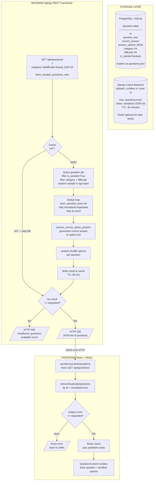

# USER_AND_DATA_FLOWS

Last verified: 2026-04-25

## 1) Primary User Flows (Level 1)

### 1.1 Solo Public Flow

1. User opens Home.
2. User selects category, difficulty, and question count.
3. Frontend fetches questions from API.
4. User answers questions one by one.
5. Answer submission updates score state.
6. Session completion stores results locally for Level 1 runtime.
7. Results screen shows score, accuracy, and question breakdown.

### 1.2 Local Group Flow

1. User opens Player Setup.
2. User enters player names (validated for range and uniqueness).
3. Frontend starts group session.
4. Questions are answered with active player context.
5. GroupPlayer score/answers are updated.
6. Results view shows ranked group outcome.

Notes:

- Group flow skips the standalone availability pre-check request and relies on session-start validation to reduce one API call per group attempt.

## 2) Route Surface and Access Model

Current active frontend route surface:

- / (home)
- /player-setup
- /quiz
- /results

Notes:

- Login/signup/dashboard/profile are present in backend capability and legacy components, but not active in the primary frontend route table for Level 1.

## 3) API Flow Details

### 3.1 Questions and Categories

- GET /categories/
- GET /questions/ with query params category, difficulty, and \_limit

Behavior:

- Category list is cached client-side in localStorage with a 24-hour TTL (`quizCategoriesCacheV1`). Stale cache is served on network failure as a fallback. API is only called on cache miss or expiry.
- In Level 1 the `CategorySelector` component uses a hardcoded `QUIZ_CATEGORIES` constant, so the categories API is rarely triggered during gameplay.
- Question sets are cache-backed on the backend and options are shuffled before response.
- Level 1 defaults to Django cache backend with Redis disabled unless explicitly enabled.

### 3.2 Session Lifecycle

- POST /sessions/ starts solo or group sessions
- POST /sessions/<id>/answer/ records answers and updates scoring
- GET /sessions/<id>/ returns session state
- GET /sessions/<id>/results/ returns result summary and per-question detail

Level 1 runtime note:

- End-of-quiz completion is local-only (auth-free path).
- Authenticated persistence and user-owned session lifecycle endpoints are kept dormant for later levels.

### 3.3 User Stats Endpoints (Auth paths)

- GET /users/<id>/
- GET /users/<id>/sessions/
- GET /users/<id>/stats/

These are not part of Level 1 primary flow but remain implementation foundations for later levels.

## 4) Guest vs Authenticated Data Path

### Guest path

- Frontend creates and stores guest identity locally.
- Request interceptor adds X-Guest-Session-ID when available.
- Guest limits and progress are enforced/stored client-side with encrypted local storage.

### Authenticated path

- Request interceptor adds Bearer access token.
- 401 handling triggers refresh flow.
- Refresh success retries queued requests.

## 5) Caching and Data Freshness

Cache-aside behavior currently implemented for:

- Questions
- Categories
- User profile
- User stats
- User sessions list
- Session result payloads for completed sessions

Cache invalidation patterns include:

- Question/category cache invalidation on content mutation
- User-centric cache invalidation on session delete/completion and profile updates

## 6) Level 1 Constraints in Data Flow

- Category set restricted by Level 1 allowlist.
- Difficulty set restricted by Level 1 allowlist.
- Group size validated to 2-6 in frontend and backend serializers.

## 7) Known Flow Risks to Revisit Before Level 2

- Some dormant auth/verification code paths exist but are not Level 1 runtime critical.
- Intelligence and runbook docs must be refreshed whenever route surface or API contracts change.
- Any increase in group size cap requires synchronized frontend/backend validation changes.

## 8) Diagrams

### 8.1 Quiz Data Flow (End-to-End)

```mermaid
flowchart TD
    subgraph FE_Home["Frontend: Home"]
        A([User selects\ncategory / difficulty / count]) --> B[quizService.fetchQuestions\nGET /api/questions/]
        B -->|prefetch + dedup| C{Enough unique\nquestions?}
        C -->|No| D[/Show inline error\nblock navigation/]
        C -->|Yes| E[dispatch setQuizSettings + hydrateQuestionsFromPrefetch\nnavigate to /quiz]
    end

    subgraph FE_Quiz["Frontend: Quiz Page"]
        E --> F[useQuizInit\nfetchQuizQuestions only when store is empty]
        F --> G[quizService.fetchQuestions\nGET /api/questions/]
        G -->|removeDuplicateQuestions\nthrow if count short| H[(Redux Store\nquestions array)]

        H --> I[QuestionContent\nRender options]
        I -->|areAnswersEquivalent\ngreen highlight| I

        H --> J[QuizActions\nhandleAnswerSelect]
        J -->|areAnswersEquivalent\nisCorrect| K[(Redux Store\nselected answers)]
    end

    subgraph FE_End["Frontend: End of Quiz"]
        K --> L[calculateQuizScore\nareAnswersEquivalent]
        L --> M([Results Page])
        K --> N[QuizSession\nlocal completion state (Level 1)]
        M --> O[ActivityDetailContent\nReview mode\nareAnswersEquivalent]
    end

    subgraph BE_Questions["Backend: Question Fetch"]
        P[fetch_seeded_questions_view\nGET /api/questions/] --> Q[get_questions_from_cache_or_db\ncache lookup + random id sampling\nseen_texts dedup]
        Q -->|pool < requested| R[/HTTP 400\ninsufficient_questions/]
        Q -->|pool OK| S[ensure_correct_option_present\nguarantee correct option in list]
        S --> T([Return JSON\nquestion list])
    end

    subgraph BE_Submit["Backend: Answer & Session Save"]
        U[submit_answer_view\nPOST /api/submit-answer/] --> V[normalize_answer_text\nselected vs correct_answer\nis_correct → DB]
        W[QuizSessionSaveSerializer\nPOST /api/save-session/] --> X[normalize_answer_text\nsolo + group answers\ncorrectness → DB]
    end

    G -->|HTTP GET fallback| P
    B -->|Primary HTTP GET| P
    N -->|No network call in Level 1 path| W
    J -->|HTTP POST per answer| U
```

### 8.2 Question Storage and Fetch Path


